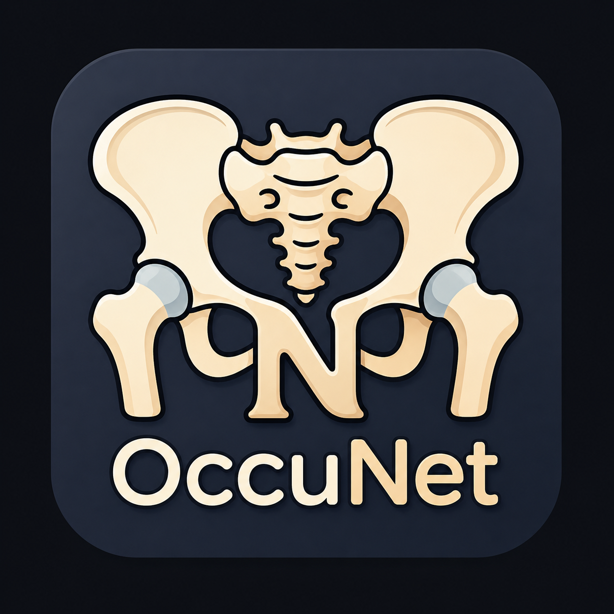

<p align="center">
  
</p>

<h1 align="center">OccuNet</h1>

<p align="center">
  A two-stage deep-learning framework for femoral-neck fracture detection on pelvic or hip radiographs.
</p>

<p align="center">
  
  
  
  
</p>

---

## Overview

OccuNet is a two-stage deep-learning framework for femoral-neck fracture detection on pelvic or hip radiographs.

This repository provides code, model configuration, pretrained Stage 1 weights, Python package requirements, and an example de-identified radiograph related to the development and evaluation of OccuNet. The framework was developed for research transparency and reproducibility in a retrospective multicenter diagnostic-accuracy study.

OccuNet combines artifact-robust contrastive pretraining with detector fine-tuning for femoral-neck fracture localization.

---

## Important notice

This repository is provided for academic research and reproducibility.

OccuNet is **not** a clinically approved diagnostic device and must not be used for clinical decision-making, triage, or patient management without prospective validation, regulatory review, and appropriate institutional approval.

Patient-level imaging data are not publicly released because of institutional privacy, ethics approval, and data-use restrictions.

---

## Repository structure

```text
OccuNet/
├── assets/
│   └── occunet_logo.png
├── OccuNet.yaml
├── stage1_contrastive_pretraining.py
├── stage1_model_weights.pt
├── stage2_OccuNet_training.py
├── requirements.txt
├── Test_radiograph.png
└── README.md
```

---

## Repository contents

| File | Description |
|---|---|
| `OccuNet.yaml` | OccuNet detector architecture configuration. |
| `stage1_contrastive_pretraining.py` | Stage 1 contrastive pretraining script for artifact-robust radiographic feature learning. |
| `stage1_model_weights.pt` | Stage 1 pretrained model weights used to initialize detector fine-tuning. |
| `stage2_OccuNet_training.py` | Stage 2 detector fine-tuning script for femoral-neck fracture localization. |
| `requirements.txt` | Python package requirements for reproducing the software environment. |
| `Test_radiograph.png` | Example de-identified radiograph for code demonstration. |

---

## Method overview

OccuNet uses a two-stage training paradigm.

### Stage 1: artifact-robust contrastive pretraining

Stage 1 uses paired original and artifact-augmented radiographs to learn artifact-invariant radiographic representations. The objective is to improve robustness to acquisition-related degradation while preserving clinically relevant femoral-neck anatomy.

### Stage 2: detector fine-tuning

Stage 2 transfers the pretrained backbone to a detector trained for femoral-neck fracture localization on pelvic or hip radiographs.

At inference, a radiograph can be classified as positive when at least one femoral-neck detection reaches the prespecified confidence threshold.

---

## Base detection framework

OccuNet was developed within a YOLOv12-compatible Ultralytics-style object-detection framework.

YOLOv12 is an attention-centric real-time object-detection framework. In OccuNet, the base detector framework was adapted for femoral-neck fracture detection on pelvic or hip radiographs through a customized model configuration, artifact-robust Stage 1 contrastive pretraining, and Stage 2 detector fine-tuning.

Users who wish to reproduce or extend the detector implementation should ensure that their local environment supports YOLOv12-compatible model definitions and Ultralytics-style training workflows.

Relevant upstream repository:

```text
https://github.com/sunsmarterjie/yolov12
```

OccuNet-specific files in this repository include:

- `OccuNet.yaml`
- `stage1_contrastive_pretraining.py`
- `stage1_model_weights.pt`
- `stage2_OccuNet_training.py`

Users should review and comply with the license terms of any third-party frameworks or dependencies used in their local implementation.

---

## Software environment

The experimental environment used for model training and evaluation included:

- Python 3.10
- PyTorch 2.8.0
- torchvision 0.23.0
- Ultralytics 8.0.196
- OpenCV 4.12.0.88
- NumPy 2.2.6
- Matplotlib 3.10.5
- PyYAML 6.0.2
- pytorch-grad-cam 1.5.5
- CUDA 12.9
- NVIDIA GeForce RTX 4060 GPU

A similar CUDA-enabled Python environment is recommended.

---

## Installation

Clone the repository:

```bash
git clone https://github.com/xinxiaolin123/OccuNet.git
cd OccuNet
```

Install dependencies:

```bash
pip install -r requirements.txt
```

OccuNet was implemented in a YOLOv12-compatible Ultralytics-style detection environment. Users should ensure that the local YOLOv12-compatible implementation is available and that `OccuNet.yaml` can be recognized by the training framework.

For users setting up the detector framework from the upstream YOLOv12 repository, see:

```text
https://github.com/sunsmarterjie/yolov12
```

The experimental environment used CUDA 12.9 and an NVIDIA GeForce RTX 4060 GPU. Users should ensure that their local PyTorch, CUDA, and GPU driver versions are compatible with their hardware and operating system.

The exact Python package versions used in the study are listed in `requirements.txt` and in the software environment section above.

---

## requirements.txt

The `requirements.txt` file should contain the following package versions:

```text
torch==2.8.0
torchvision==0.23.0
ultralytics==8.0.196
opencv-python==4.12.0.88
numpy==2.2.6
matplotlib==3.10.5
PyYAML==6.0.2
pytorch-grad-cam==1.5.5
```

CUDA, GPU drivers, and operating-system-level dependencies are not included in `requirements.txt` and should be configured separately according to the user's local hardware environment.

---

## Example workflow

Before running the scripts, update local paths, dataset locations, model paths, and output directories according to your own environment.

### Stage 1: contrastive pretraining

```bash
python stage1_contrastive_pretraining.py
```

This script performs artifact-robust contrastive pretraining and saves pretrained weights for detector initialization.

### Stage 2: detector fine-tuning

```bash
python stage2_OccuNet_training.py
```

This script fine-tunes the OccuNet detector using the architecture defined in `OccuNet.yaml`.

---

## Stage 2 configuration

The Stage 2 training script allows users to define the model configuration, dataset configuration, pretrained weights, trainable network components, and regularization strength.

Before running `stage2_OccuNet_training.py`, update the following paths in the trainer class according to your local environment:

```python
self.model_config = "/path/to/OccuNet.yaml"
self.train_config = "/path/to/default.yaml"
self.data_config = "/path/to/dataset.yaml"
self.pretrained_weights = "/path/to/stage1_model_weights.pt"
```

The script supports selective layer training through the `TRAINING_MODE` variable:

```python
TRAINING_MODE = "neck"
```

Available options are:

| Option | Trainable component |
|---|---|
| `backbone` | Backbone feature-extraction layers |
| `neck` | Neck feature-fusion layers |
| `head` | Detection head |
| `neck_head` | Neck and detection head |
| `full` | All network layers |

The script also supports different regularization settings through the `ROBUSTNESS_LEVEL` variable:

```python
ROBUSTNESS_LEVEL = "low"
```

Available options are:

| Option | Intended use |
|---|---|
| `low` | Mild regularization |
| `medium` | Moderate regularization |
| `high` | Stronger regularization |
| `extreme` | Strong regularization for exploratory sensitivity analysis |

These settings control training hyperparameters such as weight decay, dropout, learning-rate scaling, data augmentation intensity, mixup, and label smoothing.

The default configuration in the public script is intended as a runnable template. Users should adapt paths, training mode, regularization level, batch size, device ID, and dataset configuration to their own computing environment and dataset.

---

## Data format

The training pipeline expects de-identified pelvic or hip radiographs and corresponding fracture annotations in an object-detection format compatible with the Ultralytics workflow.

A typical dataset structure may follow the Ultralytics detection format:

```text
dataset/
├── images/
│   ├── train/
│   ├── val/
│   └── test/
├── labels/
│   ├── train/
│   ├── val/
│   └── test/
└── dataset.yaml
```

Each label file should contain bounding-box annotations for femoral-neck fracture regions in the format required by the detector training pipeline.

Because patient-level radiographs and annotations are subject to institutional privacy, ethics approval, and data-use restrictions, they are not included in this repository.

---

## Model output

OccuNet produces femoral-neck fracture localization outputs, including bounding boxes and confidence scores.

For radiograph-level diagnostic classification, the highest femoral-neck detection confidence can be used as the radiograph-level score. A radiograph can be classified as positive when at least one femoral-neck detection reaches the prespecified confidence threshold.

---

## Reproducibility notes

The study experiments used five independent training runs with fixed random seeds:

```text
42, 123, 456, 789, 1024
```

Binary diagnostic metrics and area under the receiver operating characteristic curve values were calculated separately for each run and summarized as mean performance across runs.

The internal test set was held out from model development and was not used for hyperparameter tuning, early stopping, or checkpoint selection.

---

## Code availability

This repository provides code and model-configuration files for research transparency and reproducibility.

The available code includes:

- Stage 1 contrastive pretraining
- Stage 2 detector fine-tuning
- Model architecture configuration
- Python package requirements
- Example de-identified radiograph for demonstration

The repository does not include patient-level imaging data, original clinical annotations, institutional databases, or protected health information.

---

## Limitations

This repository is intended to support methodological transparency. It does not provide a complete clinical deployment pipeline.

Important limitations include:

- Patient-level radiographs are not publicly available.
- External users must prepare their own de-identified datasets and annotations.
- Model performance may differ across institutions, imaging protocols, acquisition devices, patient populations, and clinical workflows.
- Prospective validation is required before any clinical use.
- Local results may differ if users modify the YOLOv12-compatible framework, package versions, hardware environment, training schedule, or dataset configuration.

---

## Contact

For questions about the code or research use, please contact the corresponding author listed in the manuscript.

---

## License and use restrictions

This repository is provided for academic research and reproducibility.

Reuse, redistribution, commercial use, or clinical deployment of the model, code, or weights may be subject to institutional, ethical, patent, and regulatory restrictions.

Users are responsible for ensuring that any use of this repository complies with applicable laws, institutional policies, data-use agreements, third-party software licenses, and ethical requirements.
